# Projeto para criação de arquivos customizados.


**SEJA BEM-VINDO A ESTE REPOSITÓRIO!!!**

-------------

**Instruções**

 - *Fork* este repositório;
 - Clone seu repositório *forked*;
 - Adicione seus scripts;
 - *Commit & Push*;
 - Crie um *pull request*;
 - Dê uma estrela para este repositório;
 - Aguarde que o seu *pull request* solicitado vire um *merge*;
 - Comemore, seu primeiro passo para o mundo de código aberto e continue contribuindo.

## Introdução

Projeto para criação de arquivos customizados, caminho destino, prefixo dos arquivos, quantidade de arquivos, se serão 
preenchidos com zero a esquerda ou não e qual será a extensão dos arquivos.

## Motivação

Inicialmente eu criei o projeto [Web-scraping-titulos-Naruto-Shippuden-e-renomear-arquivos](https://github.com/J-o-n-a-s/Web-scraping-titulos-Naruto-Shippuden-e-renomear-arquivos).
Clicando no link do projeto você poderá entender toda a motivação para a criação dele, mas farei um breve resumo aqui.
Eu tinha 500 arquivos MP4 com os episódios do Naruto Shippuden, mas o nome dos arquivos eram E001.mp4 até E500.mp4.

A forma que estavam numerados dificultava muito saber qual episódio eu tinha visto e qual ainda não tinha visto.
Para facilitar eu precisava nomeá-los com o título correto do episódio e, além disso, eu queria saber se os episódios 
eram ou não fillers.

Fiz todo o projeto, mas precisava testar se funcionaria corretamente. Tratei os caracteres que não podem ser utilizados 
no Windows, mas será que encontraria mais algum problema?
Enfim, para não testar o programa diretamente nos arquivos dos episódios e ocasionar algum problema inesperado, eu 
resolvi criar arquivos manualmente usando a mesma nomenclatura dos episódios do Naruto Shippuden.
Mas percebi que a cada erro que eu encontrava durante os testes, eu precisava deletar e recriar os arquivos.

Nas 2 primeiras vezes fiz isso, mas percebi que não estava sendo muito produtivo, então criei uma pasta com a cópia dos 
arquivos que criei manualmente, mas novamente percebi que está sendo improdutivo. Foi então que decidir criar esse 
projeto secundário que me ajudaria com o meu projeto principal.

## Descrição do projeto

Devido esse ser um projeto secundário, tentei fazê-lo de forma mais rápida e simples e posteriormente melhorá-lo e
disponibilizá-lo no GitHub.

O projeto foi desenvolvido em Python 3.11 em um único arquivo denominado (main.py) A seguir explano um pouco sobre o 
conteúdo do arquivo.

### Arquivo "main.py"

Esse é o arquivo principal e único do projeto. Ele faz toda orquestração do funcionamento do projeto.

O arquivo utiliza as bibliotecas a seguir para realizar sua tarefa:

1. Time;
2. Tkinter.

Ao iniciar o programa é informado ao usuário que ele deverá selecionar um diretório, onde os arquivos serão criados.
Conforme imagem a seguir:

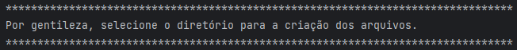

Posteriormente através da biblioteca ```tkinter``` será aberta a janela para seleção do diretório, não sendo necessário
que o usuário digite o caminho da pasta. Além disso, tendo a possibilidade de criação de uma nova pasta diretamente pela
janela aberta. Conforme imagem a seguir:

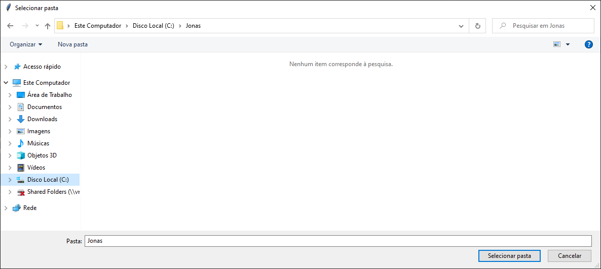

Após a seleção do diretório, o prompt do programa apresentará o caminho selecionado. Conforme imagem a seguir:

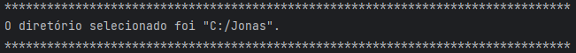

Após a seleção do diretório, o usuário será questionado sobre qual prefixo deverão ter os arquivos que serão criados.
Conforme imagem a seguir:

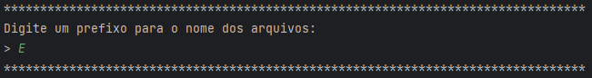

Na imagem acima foi digitado o prefixo "E". Após a seleção do prefixo o prompt do programa solicitará que seja informada
a quantidade de arquivos que se deseja criar. Conforme imagem a seguir:

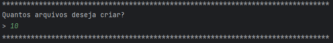

Na imagem acima foi digitado o número "10". Após informar a quantidade de arquivos que serão criados, o prompt do 
programa questiona se o usuário deseja completar o nome dos arquivos com zeros a esquerda ou não. Caso o usuário opte 
por utilizar zeros a esquerda, o programa complementará com zeros à esquerda com a quantidade de arquivos que o usuário
deseja criar. Conforme imagem a seguir:

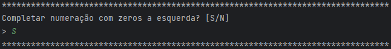

Exemplo:
  - Selecionando com zeros a esquerda (sem considerar prefixo e extensão):
    - Se o usuário digitou "10" arquivos, eles terão os nomes ````01 até 10;````
    - Se o usuário digitou "100" arquivos, eles terão os nomes ````001 até 100;````
    - Se o usuário digitou "1000" arquivos, eles terão os nomes ````0001 até 1000.````


  - Selecionando sem zeros a esquerda (sem considerar prefixo e extensão):
    - Se o usuário digitou "10" arquivos, eles terão os nomes ````1 até 10;````
    - Se o usuário digitou "100" arquivos, eles terão os nomes ````1 até 100;````
    - Se o usuário digitou "1000" arquivos, eles terão os nomes ````1 até 1000.````

Na imagem acima foi digitado "S" para indicar que o usuário deseja os zeros a esquerda. Após o usuário informar no 
prompt do programa se ele deseja ou não zeros a esquerda, ele será questionado sobre qual será a extensão dos arquivos.
Ele deve digitar uma extensão com no mínimo 2 e no máximo 4 caracteres e sem ponto. Conforme imagem a seguir:

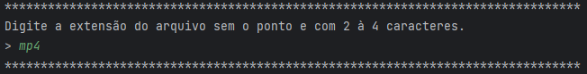

Na imagem acima foi digitada a extensão "mp4". Após o usuário informar no prompt do programa a extensão dos arquivos que
ele deseja, será apresentado como ficarão os arquivos criados e ele será questionado se deseja confirmar a criação dos
arquivos. Conforme imagem a seguir:

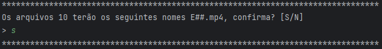

Na imagem acima foi digitado "S" confirmando que o usuário deseja continuar com a criação dos arquivos. Após a 
confirmação de que o usuário deseja criar os arquivos, basta aguardar enquanto os arquivos são criados, será 
apresentada uma mensagem após a criação de cada arquivo. Conforme imagem a seguir:

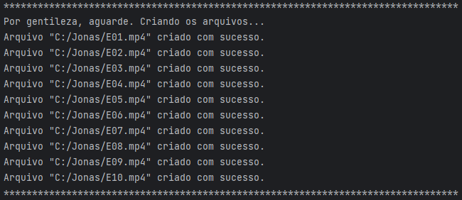

Ao fim da criação dos arquivos, o programa será finalizado. Conforme imagem a seguir:

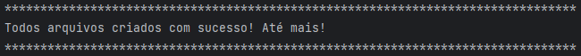

Após isso, basta verificar a pasta selecionada e os arquivos estarão lá. Conforme imagem a seguir:

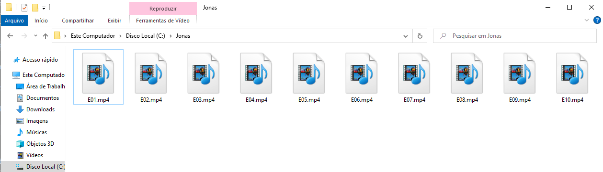

### Bibliotecas e recursos utilizados

 - Time -> Para adição de tempo entre a criação dos arquivos e facilitar a visualização;
 - Tkinter -> Para a abertura da tela de seleção da pasta onde os arquivos deverão ser criados.

 ## Instalação e execução do projeto

 - `pip install poetry` para instalar o gerenciador de pacotes;
 - `poetry install` para que o poetry instale os pacotes usados no projeto;
 - `poetry shell` para que o poetry crie um ambiente virtual;
 - `python criacaodearquivos/main.py` para executar o projeto.

 ## Licença

 MIT License
 